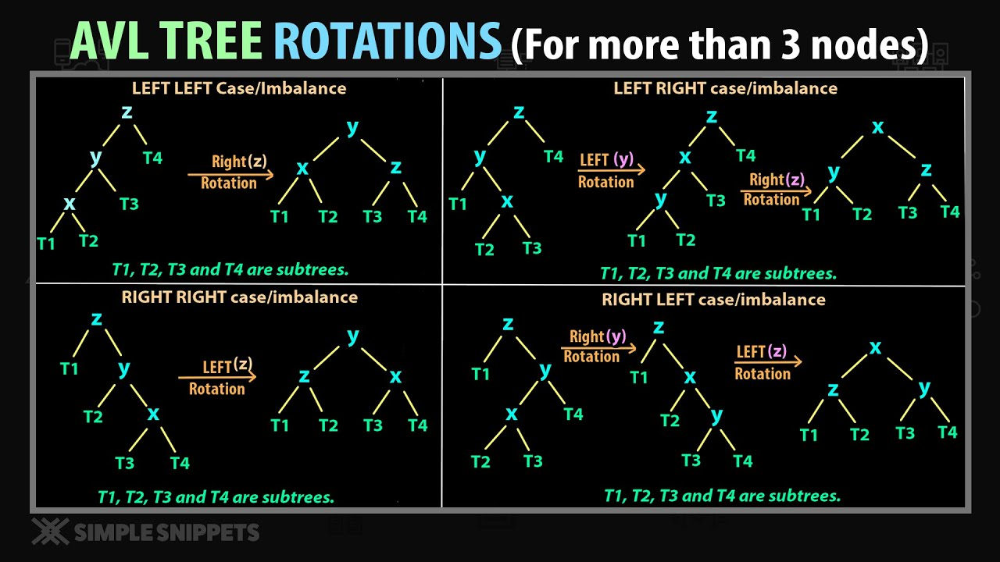

<h1 align="center">AVL Tree</h1>

AVL tree is a self-balancing Binary Search Tree (BST) where the difference between heights of left and right subtrees cannot be more than one for all nodes. 

**1. It is Binary Search Tree**

**2. Balance Factor must be {-1,0,1}.**

​	Balance Factor = |height of left subtree|-|height of right subtree|

So whenever balance factor is greater than |1|. Then we apply different rotation and bring the balance factor in the range of -1 to 1.

*Most of the BST operations (e.g., search, max, min, insert, delete.. etc) take O(h) time where h is the height of the BST. The cost of these operations may become O(n) for a skewed Binary tree. If we make sure that height of the tree remains O(Logn) after every insertion and deletion, then we can guarantee an upper bound of O(Logn) for all these operations.*

## Rotation

To make sure given Tree remains AVL after every insertion & deletion, we must perform some re-balancing. 

## Operation

**During Insertion and Deletion , the condition of BST and Balance Factor <=|1| must be satisfied.**

### Insertion

Similar to BST. But After each insertion balance factor should be checked. And if the balance factor >1 then apply some rotation to balance it.

### Deletion

Similar to BST. But After each deletion balance factor should be checked. And if the balance factor >1 then apply some rotation to balance it.

### Search

Similar to BST.

