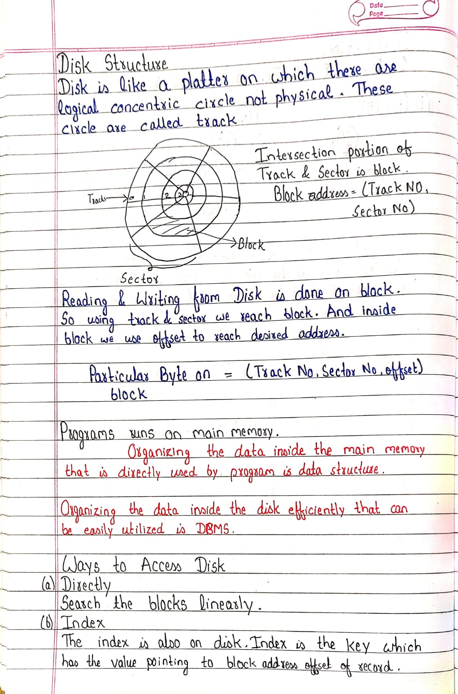
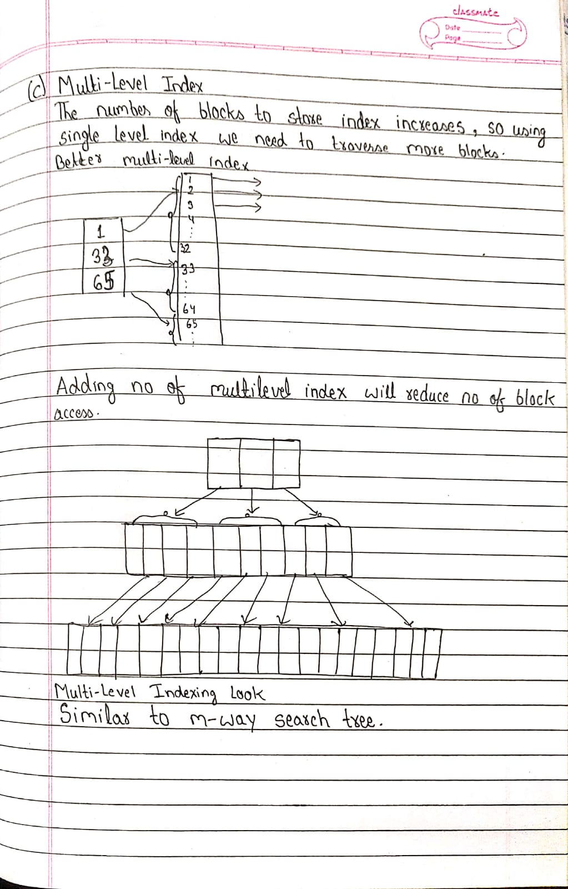
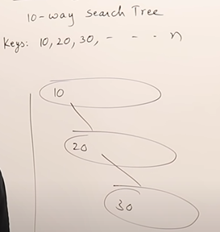

<h1 align="center">M-Way Search Tree</h1>

In most of the other self-balancing search trees (like AVL and Red-Black Trees), it is assumed that everything is in main memory. To understand the use of B-Trees, we must think of the huge amount of data that cannot fit in main memory. When the number of keys is high, the data is read from disk in the form of blocks. Disk access time is very high compared to the main memory access time. The main idea of using **M-Way Search** Trees is to reduce the number of disk accesses.

The m-way search trees are multi-way trees which are generalized versions of binary trees where each node contains multiple elements. In an m-Way tree of order m, each node contains a maximum of m – 1 keys and each node has maximum m children.

#### Problem of M-Way Search Tree ?

There is no guidelines for creation process of M-Way Search Tree.

So here after n insertion the tree may become skewed completely and it will take O(n) time similar to linear search. 

#### So we shift to B tree because it is similar to m-way search tree with some rules. 

