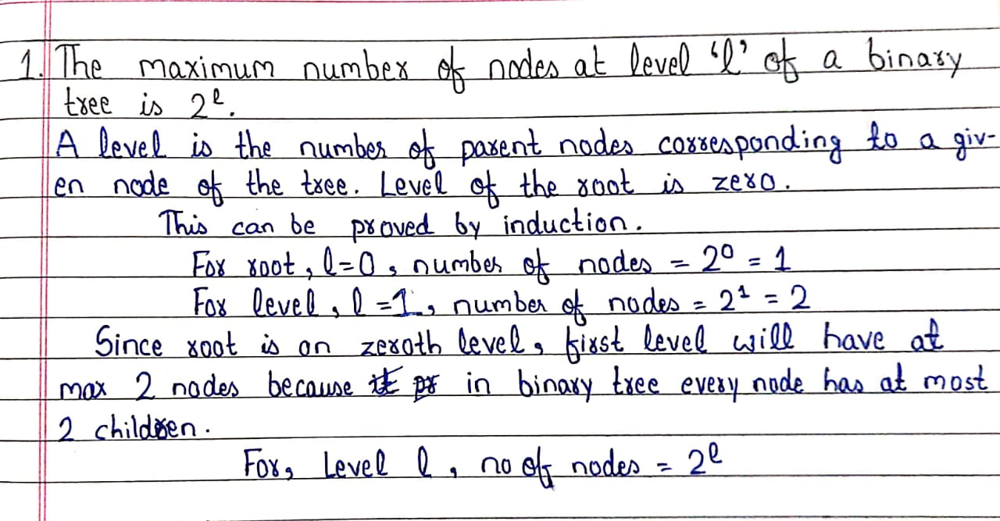
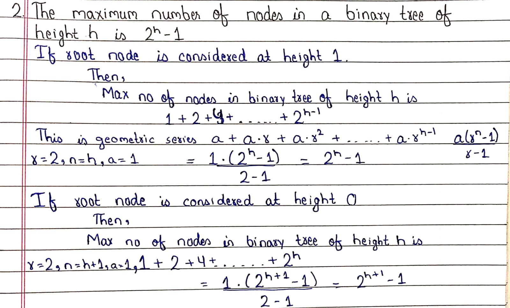
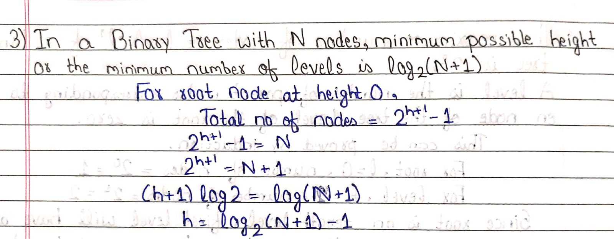
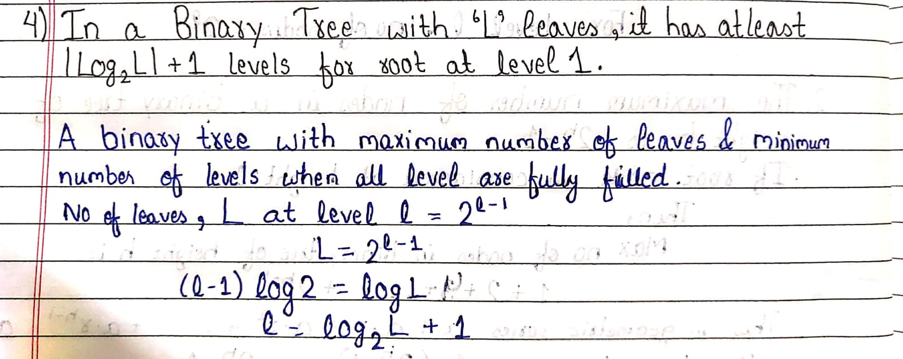
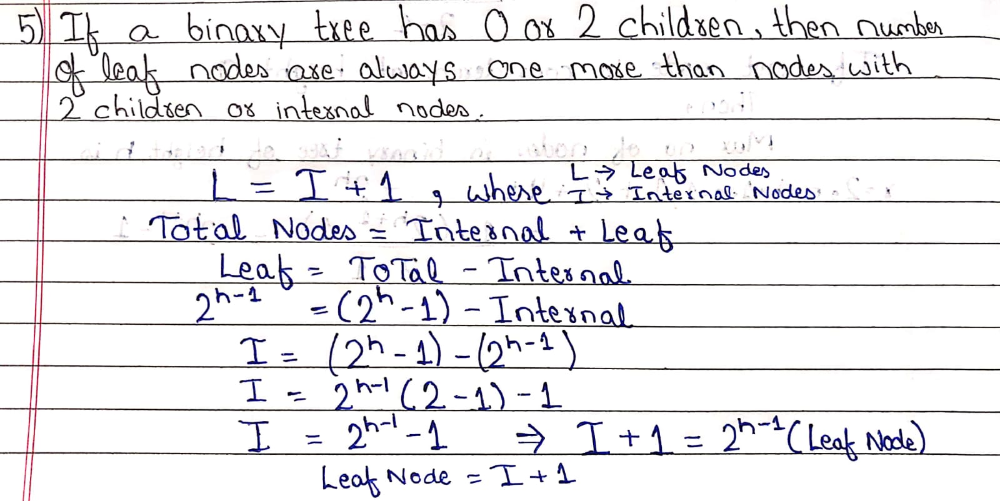
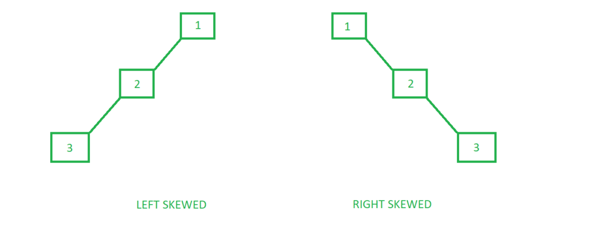

<h1 align="center">Binary Trees</h1>

A tree whose element have at most 2 children is called binary trees. Since each element in a binary tree can have only 2 children, we name them left child & right child.

A Binary Tree node contains the following parts : 

- Data
- Pointer to left child
- Pointer to right child

A simple binary tree : 

```c++
#include<bits/stdc++.h>
using namespace std;

struct Node{
    int data;
    struct Node* left;
    struct Node* right;
    
    Node(int x){
        data=x;
        left=NULL;
        right=NULL;
    }
};

int main(){
    Node* root = new Node(1);
    /* The tree after above statement
 
             1
            / \
          NULL NULL
    */
    root->left = new Node(2);
    root->right = new Node(3);
    /* The tree after above statement
 
             1
            / \
           2   3
    */
}
```

<div style="page-break-after: always; break-after: page;"></div>

## Properties 











<div style="page-break-after: always; break-after: page;"></div>

## Types of Binary Tree

###  Full Binary Tree

A binary tree is a full binary tree if every node has 0 or 2 children. We can also say a binary tree is full it all nodes has two children except leaf nodes. The examples of full binary tree is :

```
           		       10
           		     /    \
           		    11     12
           		   / \     / \
           		  13 14   15 16
           		  
           		  
           		       10
           		     /    \
           		    11     12
           		   / \     
           		  13 14
           		  
           		  
           		       10
           		     /    \
           		    11     12
           		           / \
           		  		  15 16
```


### Complete Binary Tree

A binary tree is a complete binary tree if all the levels are completely filled or the last unfilled level  has all keys on left .  The examples of complete binary tree are :- 

```
           		       10
           		     /    \
           		    11     12
           		   /       
           		  13 
                  
           		       10
           		     /    \
           		    11     12
           		   / \     / \
           		  13 14   15 16
```

<div style="page-break-after: always; break-after: page;"></div>

### Perfect Binary Tree 

A binary tree is perfect if all the levels are completely filled or we can say that all internal nodes have two children & leaf nodes are at the same level.

```
           		       10
           		     /    \
           		    11     12
           		   / \     / \
           		  13 14   15 16
           		   
           		   
           		       10
           		     /    \
           		    11     12
```

### Skewed Binary Tree

A skewed binary tree is a binary tree in which all nodes have only one child or no child.

- Left Skewed Binary Tree
- Right Skewed Binary Tree



<div style="page-break-after: always; break-after: page;"></div>

## Count of Binary Trees

A Binary Tree is labeled if every node is assigned a label and a Binary Tree is unlabelled if nodes are not assigned any label. 

```
Below two are considered same unlabelled trees
    o                 o
  /   \             /   \ 
 o     o           o     o 

Below two are considered different labelled trees
    A                C
  /   \             /  \ 
 B     C           A    B 
```

**How many different Unlabelled Binary Trees can be there with n nodes?**

It is equal to catalan number. 

```
T(n) = (2n)! / (n+1)!n!
```

*The number of Binary Search Trees (BST) with n nodes is also the same as the number of unlabelled trees. The reason for this is simple, in BST also we can make any key a root, If the root is i’th key in sorted order, then i-1 keys can go on one side, and (n-i) keys can go on another side. *

**How many labeled Binary Trees can be there with n nodes?** 
To count labeled trees, we can use the above count for unlabeled trees. The idea is simple, every unlabeled tree with n nodes can create n!.

```
Number of Labelled Trees = (Number of unlabelled trees) * n!
                       = [(2n)! / (n+1)!n!]  × n!
```

