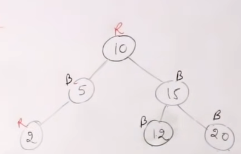
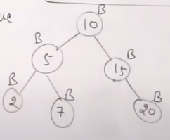
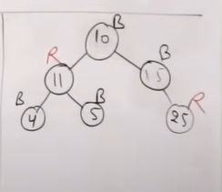
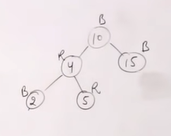

<h1 align="center">Red Black Tree</h1>

A red-black tree is a kind of self-balancing binary search tree where each node has an extra bit, and that bit is often interpreted as the color (red or black). These colors are used to ensure that the tree remains balanced during insertions and deletions. Although the balance of the tree is not perfect, but it is good enough to reduce the searching time and maintain it around O(log n) time, where n is the total number of elements in the tree.

**AVL is strictly balanced RED BLACK TREE. Red black tree is not perfectly balanced. AVL trees are subset of RBT. If a tree is AVL so when we color it properly then it can be RBT.**

**The AVL trees are more balanced compared to Red-Black Trees, but they may cause more rotations during insertion and deletion. So if your application involves frequent insertions and deletions, then Red-Black trees should be preferred because at max 2 rotation and recoloring will occur.. And if the insertions and deletions are less frequent and search is a more frequent operation, then AVL tree should be preferred over Red-Black Tree.**

#### AVL Tree with n node can’t exceed 1.44*logn height. 

#### Red Black Tree with n node can’t exceed 2*logn height.

## Properties

- It is a self-balancing BST.
- Every node is either Black or Red. Root node is always black.
- Every leaf which is NIL is black.
- If node is red then its children must be black. Red-Red relationship isn’t allowed.
- Every path from a root to any of its descendent NIL node has same number of Black nodes.

### Example :

##### 1. The given tree isn’t AVL because the root is red

##### 2. Here the path from a root to any of its descendent NIL node hasn’t same number of black nodes. 10-15-Nil has only 2 black nodes. Rest of them have 3 black nodes.

#### A perfect binary tree having all nodes black is a RED-Black Tree.

##### 3. It isn’t following BST property.

##### 4. It violates the property where red & red node can’t be adjacent.

