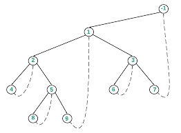

<h1 align="center">Morris Traversal</h1>

Using Morris Traversal, we can traverse the tree without using stack and recursion. The idea of Morris Traversal is based on Threaded Binary Tree.


## PreOrder

```c++
1. Initialize current as root
2. While current is not null
	if(current->left==NULL)
		Print(current->data);
		current=current->right;
	else
    	predecessor=inorderPredecessor(current)
    	if(predecessor->right==NULL){
            Print(current->data);
    		predecessor->right=current;
    		current=current->left
    	}else{
    		predecessor->right=NULL;
    		current=current->right;
    	}			
```

## InOrder

```c++
1. Initialize current as root
2. While current is not null
	if(current->left==NULL)
		Print(current->data);
		current=current->right;
	else
    	predecessor=inorderPredecessor(current)
    	if(predecessor->right==NULL){
    		predecessor->right=current;
    		current=current->left
    	}else{
    		predecessor->right=NULL;
    		Print(current->data);
    		current=current->right;
    	}			
```



## PostOrder

```c++
1. Create a dummy node and make the root as it's left child.
2. Initialize current with dummy node
2. While current is not null
	if(current->left==NULL)
		current=current->right;
	else
    	predecessor=inorderPredecessor(current)
    	if(predecessor->right==NULL){
    		predecessor->right=current;
    		current=current->left
    	}else{
    		predecessor->right=NULL;
    		succesor=current;
            current = current->left;
            prev = NULL;     
            // Traverse along the right subtree 
            // to the right-most child
            while (current != NULL){
                    temp = current->right;
                    current->right = prev;
                    prev = current;
                    current = temp;
            }
            // Traverse back to current's left child node
            while (prev != NULL){
                    cout << prev->data << " ";
                    temp = prev->right;
                    prev->right = current;
                    current = prev;
                    prev = temp;
            }
            current = succ;
            current = current->right;
		
```

