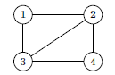
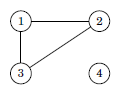
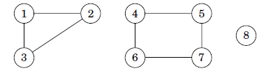
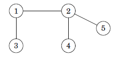
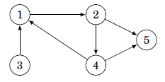
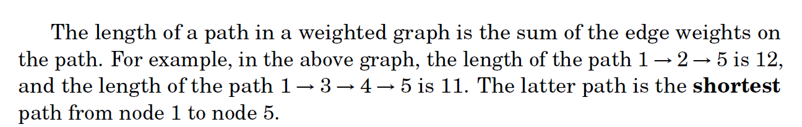

<h1 align="center">Graph</h1>

A graph consist of nodes & edges. A path leads from node a to node b through edges of the graph. The length of the path is the number of edges in it path. 

A path is cyclic if the start and end node are same. A path is simple if each node appears at most once in the path.

**Connectivity**
A graph is connected if there is a path between any two nodes. The following graph is connected :
															

The following graph is not connected because it is not possible to get to node 4 from any other node.
															 

**Components**
The connected parts of a graph are called as components.

A **tree** is a connected acyclic graph that consists of n nodes and n-1 edges. There is a unique path between any two nodes of a tree. For example, the following graph is a tree:
													

**Directed  Graph**
A graph is directed if the edges can be traversed in one direction only. For example, the following graph is directed:
													 

**Weighted Graph**
In a weighted graph, each edge is assigned a weight. The weights are often interpreted as edge lengths. For example, the following graph is weighted:
                                      			

**Neighbors & Degrees**
Two nodes are neighbors or adjacent if there is an edge between them. The degree of a node is the number of its neighbors. For example, in the following graph, the neighbors of node 2 are 1, 4 and 5, so its degree is 3.

A graph is regular if the degree of every node is a constant d. A graph is complete if the degree of every node is n-1, the graph contains all possible edges between the nodes.
In a directed graph, the indegree of a node is the number of edges that end at the node, and the outdegree of a node is the number of edges that start at the node.

**Colorings**
In a coloring of a graph, each node is assigned a color so that no adjacent nodes have the same color.
A graph is bipartite if it is possible to color it using two colors.

A **bipartite graph**, also called a bigraph, is a set of **graph** vertices decomposed into two disjoint sets such that no two vertices of a **graph** within the same set are adjacent.

**Simple Graph**
A graph is simple if no edge starts and ends at the same node, and there are no multiple edges between two nodes. Often we assume that graphs are simple.

