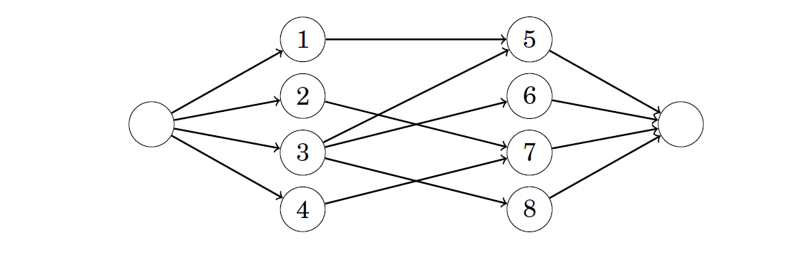
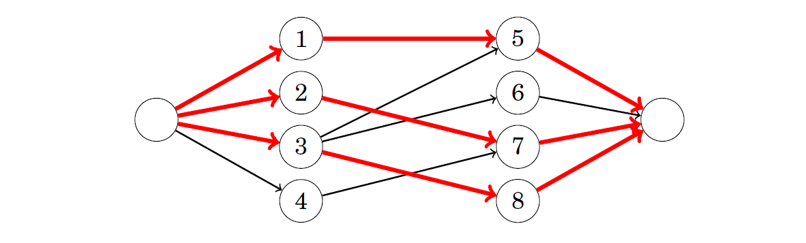

# Flows & Cuts

In this chapter all the graph we discuss are directed weighted graph that contains two special nodes: the source is a node with no incoming edges, and the sink is a node with no outgoing edges.

As an example, we will use the following graph where node 1 is the source and node 6 is the sink: 

## Maximum Flow 

For these types of problem , our task is to send as much flow as possible from source to the sink. The weight of each edge is a capacity that restricts the flow that can go through the edge. In each intermediate node, the incoming and outgoing flow has to be equal.
For example, the maximum size of a flow in the example graph is 7. The following picture shows how we can route the flow:


The notation v/k means that a flow of v units is routed through an edge whose capacity is k units. The size of the flow is 7, because the source sends 3+4 units of flow and the sink receives 5+2 units of flow. It is easy see that this flow is maximum, because the total capacity of the edges leading to the sink is 7.

## Minimum Cut

In the minimum cut problem, our task is to remove a set of edges from the graph such that there will be no path from the source to the sink after the removal and the total weight of the removed edges is minimum.
The minimum size of a cut in the example graph is 7. It suffices to remove the edges 2->3 and 4->5:

After removing the edges, there will be no path from the source to the sink. The size of the cut is 7, because the weights of the removed edges are 6 and 1. The cut is minimum, because there is no valid way to remove edges from the graph such that their total weight would be less than 7.

It is not a coincidence that the maximum size of a flow and the minimum size of a cut are the same in the above example. It turns out that a maximum flow and a minimum cut are always equally large & same, so the concepts are two sides of the same coin.

## Ford-Fulkerson Algorithm

Ford–Fulkerson algorithm can be used to find the maximum flow and minimum cut of a graph. The algorithm also helps us to understand why maximum flow and a minimum cut are always equally large.

The algorithm begins with an empty flow, and at each step finds a path from the source to the sink that generates more flow. Finally, when the algorithm cannot increase the flow anymore, the maximum flow has been found.

The algorithm uses a special representation of the graph where each original edge has a reverse edge in another direction. The weight of each edge indicates how much more flow we could route through it. At the beginning of the algorithm, the weight of each original edge equals the capacity of the edge and the weight of each reverse edge is zero.

The new representation for the example graph is as follows:


### Algorithm

It consist of several rounds. On each round,the algorithm finds a path from source to the sink such that each edge on the path has a positive weight. If there is more than one possible path available, we choose any of them.

For example, suppose we choose the following path:


After choosing the path, the flow increases by x units, where x is the smallest edge weight on the path. In addition, the weight of each edge on the path decreases by x and the weight of each reverse edge increases by x.

In the above path, the weight on the edges are 5,6,8 and 2. The smallest weight is 2, so the flow increases by 2 and the new graph is as follows:


The idea is that increasing the flow decrease the amount of flow that can go through the edges in the future. This algorithm increases the flow as long as there is a path from source to sink through positive edges. In present example the next path can be as follows:


The minimum edge weight on this path is 3, so the path increases the flow by 3, and the total flow after processing the path is 5.

The new graph will be as follows:


We still need two more rounds before reaching the maximum flow. For example, we can choose the paths 1->2->3->6 and 1->4->5->3->6. Both paths increase the flow by 1, and the final graph is as follows:


It is not possible to increase the flow anymore, because there is no path from the source to the sink with positive edge weights. Hence, the algorithm terminates and the maximum flow is 7.

> In Simple Words,
> The following is simple idea of Ford-Fulkerson algorithm:
> 1) Start with initial flow as 0.
> 2) While there is a augmenting path from source to sink. 
>         Add this path-flow to flow.
> 3) Return flow.

**Time Complexity:** Time complexity of the above algorithm is O(max_flow * E). We run a loop while there is an augmenting path. In worst case, we may add 1 unit flow in every iteration. Therefore the time complexity becomes O(max_flow * E).

### Implementation

```cpp
#include<bits/stdc++.h>
using namespace std;
#define ll long long int
ll arr[501][501];
ll rGraph[501][501];
bool bfs(ll src,ll sink,ll parent[]){
    bool visited[sink+1];
    memset(visited,0,sizeof(visited));
    queue<ll>q;
    q.push(src);
    visited[src]=true;
    parent[src]=-1;
    while(!q.empty()){
        ll u = q.front();
        q.pop();
         for (int v = 1; v<=sink; v++) {
             if(!visited[v] && rGraph[u][v]>0){
                //If we find a connection to the sink node
                if(v==sink){
                    parent[v]=u;
                    return true;
                } 
                q.push(v);
                parent[v]=u;
                visited[v]=true;
             }
         }     
    }
    //Unable to reach sink
    return false;
}

ll fordFulkerson(ll src,ll sink){
    /*Fill residual graph with given capacities in the original
    graph. Residual graph indicates residual capacity of edge
    from i to j.*/
    for(ll i=1;i<=sink;i++){
        for(ll j=1;j<=sink;j++){
            rGraph[i][j]=arr[i][j];
        }
    }
    //Path is stored to find minimum edge weight in the path. 
    ll parent[sink+1];
    ll maxFlow=0;
    while(bfs(src,sink,parent)){
        ll pathflow = LLONG_MAX;
        for(ll i=sink; i!=src; i=parent[i]){
            ll j= parent[i];
            pathflow = min(pathflow,rGraph[j][i]);
        }
        for(ll i=sink; i!=src; i=parent[i]){
            ll j= parent[i];
            rGraph[j][i]-=pathflow;
            rGraph[i][j]+=pathflow;
        }
        maxFlow+=pathflow;
    }
    return maxFlow;
}
int main(){
    ll n,e;
    cin>>n>>e;
    memset(arr,0,sizeof(arr));
    for(ll i=0;i<e;i++){
        ll a,b,c;
        cin>>a>>b>>c;
        //If there exist multiple paths between u and v
        arr[a][b]+=c;
    }
    /*// To Display Input Array
    for(ll i=1;i<=n;i++){
        for(ll j=1;j<=n;j++){
            cout<<arr[i][j]<<"\t";
        }
        cout<<endl;
    }*/
    cout<<fordFulkerson(1,n);
}
```

**Note: ** **Edmonds**-Karp differs from **Ford**-**Fulkerson** in that it chooses the next augmenting path using breadth-first search (bfs). 

## Minimum Cuts

Ford–Fulkerson algorithm has found a maximum flow, it has also determined a minimum cut. Let A be the set of nodes that can be reached from the source using positive-weight edges. In the example graph, A contains nodes 1, 2 and 4:


Now the minimum cut consists of the edges of the original graph that start at some node in A, end at some node outside A, and whose capacity is fully used in the maximum flow. In the above graph, such edges are 2->3 and 4->5, that correspond to the minimum cut 6+1= 7.

**Why is the flow produced by the algorithm maximum and why is the cut minimum?** 
**Ans:** The reason is that a graph cannot contain a flow whose size is larger than the weight of any cut of the graph. Hence, always when a flow and a cut are equally large, they are a maximum flow and a minimum cut.

The Ford–Fulkerson algorithm produces a flow whose size is exactly as large as the size of a cut in the graph. Thus, the flow has to be a maximum flow and the cut has to be a minimum cut.

### **Algorithm**

**1)** Run Ford-Fulkerson algorithm and consider the final residual graph.

**2)** Find the set of vertices that are reachable from the source in the residual graph.

**3)** All edges which are from a reachable vertex to non-reachable vertex are minimum cut edges. Print all such edges.

Step 3 is done by applying dfs on the source vertex and keeping track of all the possible nodes which can be visited from source.

### **Implementation**

```cpp
#include<bits/stdc++.h>
using namespace std;
#define ll long long int
ll arr[501][501];
ll rGraph[501][501];
bool bfs(ll src,ll sink,ll parent[]){
    bool visited[sink+1];
    memset(visited,0,sizeof(visited));
    queue<ll>q;
    q.push(src);
    visited[src]=true;
    parent[src]=-1;
    while(!q.empty()){
        ll u = q.front();
        q.pop();
         for (int v = 1; v<=sink; v++) {
             if(!visited[v] && rGraph[u][v]>0){
                //If we find a connection to the sink node
                if(v==sink){
                    parent[v]=u;
                    return true;
                } 
                q.push(v);
                parent[v]=u;
                visited[v]=true;
             }
         }     
    }
    //Unable to reach sink
    return false;
}
void dfs(ll s,ll sink, bool visited[]) 
{ 
    visited[s] = true; 
    for (ll i = 1; i <= sink; i++) 
       if (rGraph[s][i] && !visited[i]) 
           dfs(i,sink, visited); 
} 
 
ll fordFulkerson(ll src,ll sink){
    /*Fill residual graph with given capacities in the original
    graph. Residual graph indicates residual capacity of edge
    from i to j.*/
    for(ll i=1;i<=sink;i++){
        for(ll j=1;j<=sink;j++){
            rGraph[i][j]=arr[i][j];
        }
    }
    //Path is stored to find minimum edge weight in the path. 
    ll parent[sink+1];
    std::vector<pair<ll,ll>> ans;
    ll maxFlow=0;
    while(bfs(src,sink,parent)){
        ll pathflow = LLONG_MAX;
        for(ll i=sink; i!=src; i=parent[i]){
            ll j= parent[i];
            pathflow = min(pathflow,rGraph[j][i]);
        }
        for(ll i=sink; i!=src; i=parent[i]){
            ll j= parent[i];
            rGraph[j][i]-=pathflow;
            rGraph[i][j]+=pathflow;
        }
        maxFlow+=pathflow;
    }
    cout<<maxFlow<<endl;
     bool visited[sink+1]; 
    memset(visited, false, sizeof(visited)); 
    dfs(src,sink, visited); 
  
    // Print all edges that are from a reachable vertex to 
    // non-reachable vertex in the original graph 
    for (ll i = 1; i <= sink; i++) 
      for (ll j = 1; j <= sink; j++) 
         if (visited[i] && !visited[j] && arr[i][j]) 
              cout << i << " " << j << endl; 
  
    return maxFlow;
}
int main(){
    ll n,e;
    cin>>n>>e;
    memset(arr,0,sizeof(arr));
    for(ll i=0;i<e;i++){
        ll a,b,c;
        cin>>a>>b>>c;
        //If there exist multiple paths between u and v
        arr[a][b]+=c;
    }
    fordFulkerson(1,n);
}
```

## Disjoint Paths

Many graph problems can be solved by reducing them to the maximum flow problem. Our first example of such a problem is as follows: we are given a directed graph with a source and a sink, and our task is to find the maximum number of disjoint paths from the source to the sink.

### Edge-disjoint Paths

It turns out that the maximum number of edge-disjoint paths equals the maximum flow of the graph, assuming that the capacity of each edge is one. After the maximum flow has been constructed, the edge-disjoint paths can be found greedily by following paths from the source to the sink.

For example consider the following graph:


In this graph, the maximum number of edge disjoint paths is 2. We can choose
the paths 1->2->4->3->6 and 1->4->5->6 as follows:


### Node-disjoint Paths

In this problem, we have to find the maximum number of node-disjoint paths from source to the sink. In this problem, every node, except for the source and sink, only appear once in the path. The number of node-disjoint paths may be smaller than the number of edge-disjoint paths. 

For example, in the previous graph, the maximum number of node-disjoint paths is 1.


We can reduce also this problem to the maximum flow problem. Since each node can appear in at most one path, we have to limit the flow that goes through the nodes. A standard method for this is to divide each node into two nodes such that the first node has the incoming edges of the original node, the second node has the outgoing edges of the original node, and there is a new edge from the first node to the second node.

## Maximum Matchings

The maximum matching problem asks to find a maximum-size set of node pairs in an undirected graph such that each pair is connected with an edge and each node belongs to at most one pair.

#### Finding maximum matchings

The nodes of a bipartite graph can be always divided into two groups such that all edges of the graph go from the left group to the right group. For example, in the following bipartite graph, the groups are {1,2,3,4} and {5,6,7,8}.


The size of a maximum matching of this graph is 3:


We can reduce the bipartite maximum matching problem to the maximum flow problem by adding two new nodes to the graph: a source and a sink. We also add edges from the source to each left node and from each right node to the sink. After this, the size of a maximum flow in the graph equals the size of a maximum matching in the original graph.

For example, the reduction for the above graph is as follows:



The maximum flow of this graph is as follows:



## Hall’s Theorem

Hall’s theorem can be used to find out whether a bipartite graph has a matching that contains all left or right nodes. If the number of left and right nodes is the same, Hall’s theorem tells us if it is possible to construct a perfect matching that contains all nodes of the graph.

Assume that we want to find a matching that contains all left nodes. Let X be any set of left nodes and let f (X) be the set of their neighbors. According to Hall’s theorem, a matching that contains all left nodes exists exactly when for each X, the condition |X| <=  |f (X)| holds.

Hall’s Theorem Holds:


Hall’s Theorem Doesn’t Holds:


## Konig’s Theorem

A minimum node cover of a graph is a minimum set of nodes such that each edge of the graph has at least one endpoint in the set. However, if the graph is bipartite, Konig’s theorem tells us that the size of a minimum node cover and the size of a maximum matching are always equal. Thus, we can calculate the size of a minimum node cover using a maximum flow algorithm.

Let us consider the following graph with a maximum matching of size 3:


Here the maxFlow is 3 and even the maximum size is 3.

## Path Covers

A path cover is a set of paths in a graph such that each node of the graph belongs to at least one path. It turns out that in directed, acyclic graphs, we can reduce the problem of finding a minimum path cover to the problem of finding a maximum flow in another graph.

### Node-disjoint path cover

In a node-disjoint path cover, each node belongs to exactly one path. As an example, consider the following graph:

A minimum node-disjoint path cover of this graph consists of three paths. For example, we can choose the following paths:


## Dilworth’s theorem

An antichain is a set of nodes of a graph such that there is no path from any node to another node using the edges of the graph. Dilworth’s theorem states that in a directed acyclic graph, the size of a minimum general path cover equals the size of a maximum antichain.

For example, nodes 3 and 7 form an antichain in the following graph:


This is a maximum antichain, because it is not possible to construct any antichain that would contain three nodes. We have seen before that the size of a minimum general path cover of this graph consists of two paths.

