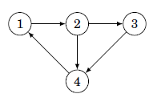
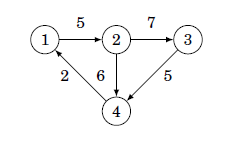
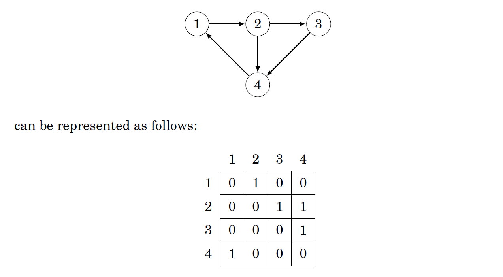
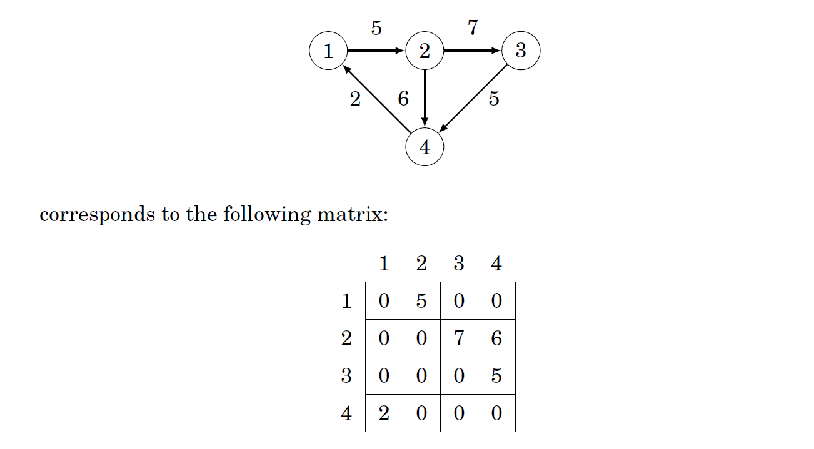

<h1 align="center">Graph Representation</h1>


## Adjacency List Representation

A convenient way to store the adjacency lists is to declare an array of vectors as follows:

```cpp
vector<int> adj[N];
```

The constant N(No of Nodes) is chosen so that all adjacency lists can be stored. For example 

​																			

```cpp
#include<bits/stdc++.h>
using namespace std;
int main(){
    int n;//No of nodes
    cin>>n;
    vector<int>adj[n+1];
    int e;
    cin>>e;
    bool bidir; // If the graph is bidirectional
    cin>>bidir; 
    int start,end;
    
    for(int i=0;i<e;i++){
        cin>>start>>end; //Enter the start and end nodes
        adj[start].push_back(end);
        if(bidir){
            adj[end].push_back(start);
        }
    }

    for(int i=1;i<=n;i++){
        cout<<i<<"--> ";
        for(auto it=adj[i].begin();it!=adj[i].end();it++){
            cout<<*it<<",";
        }
        cout<<endl;
    }
}

/*
4 5 0
1 2
2 3
2 4
3 4
4 1*/
```

If the graph is weighted then it can extended as follows :

```cpp
vector<pair<int,int>>adj[N];
```

In this case the adjacency list of a node contains the pair {b,w} always when there is an edge from node a to node b with weight w. For example, the graph 



can be stores as follows:

```cpp
#include<bits/stdc++.h>
using namespace std;
int main(){
int n;//No of nodes
cin>>n;
vector<pair<int,int>>adj[n+1];
int e;//No of edges
cin>>e;
int start,end,weight;
    
    for(int i=0;i<e;i++){
        cin>>start>>end>>weight; //Enter the start,end & weight og nodes
        adj[start].push_back({end,weight});
    }

    for(int i=1;i<=n;i++){
        cout<<i<<"--> ";
        for(auto u:adj[i]){
            cout<<"{"<<u.first<<","<<u.second<<"} ";
        }
        cout<<endl;
    }
}
```


<div style="page-break-after: always; break-after: page;"></div>

## Adjacency Matrix Representation

An adjacency matrix is a 2-dimensional array that indicates which edge the graph contains.

```c++
int adj[N][N];
```

where value of adj[a] [b] indicates whether the graph contain an edge from node a to node b. If there is a edge then the value is 1 nor it is 0. For example the graph



If the graph is weighted , then the matrix contains the weight of the edge.



## Edge List Representation

An edge list contains all the edges in some order. This is used when algorithm processes all edges of the graph.

```c++
vector<pair<int,int>>edges;
```

where each pair(a,b) denotes there is an edge from node a to node b.

If the graph is weighted, the structure can be extended as follows :

```cpp
#include<bits/stdc++.h>
using namespace std;
int main(){
vector<tuple<int,int,int>>edges;
int e;
cin>>e;
    for(int i=0;i<e;i++){
      int start,end,weight;
      cin>>start>>end>>weight;
      edges.push_back({start,end,weight});
    }
    for(int i=0;i<e;i++){
        cout<<"{"<<get<0>(edges[i])<<","<<get<1>(edges[i])<<","<<get<2>(edges[i])<<"}";
    }
}
```

