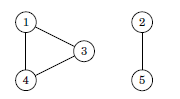
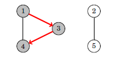

<h1 align="center">Graph Traversal</h1>

## Depth First Search

DFS(Depth First Search) uses Stack data structure. It traverses graph ‘Depth-first’ starting from source , then picks one of the unvisited neighbors and visit it.

The time complexity of depth-first search is O(V+E) where V is the number of nodes and E is the number of edges, because the algorithm processes each node and edge once.

The **DFS** function below assumes graph is stored in adjacency lists 

```cpp
vector<int>adj[N]; //N is the no of nodes
```

and also maintain an array that keeps track of the visited nodes. 

```
bool visited[N];
```

The **DFS** can be implemented as

```
void dfs(int n){
 if(visited[n]){
 	return ;
 }
 cout<<n<<" ";
 visited[n]=1;
 for(auto u: adj[n]){
 	dfs(u);
 }
}
```

The complete implementation is :

```cpp
#include<bits/stdc++.h>
using namespace std;

void dfs(int src,vector<bool>&visited,vector<int>adj[]){
    if(visited[src]){
        return ;
    }
    cout<<src<<" ";
    visited[src]=true;
    for(auto u:adj[src]){
        dfs(u,visited,adj);
    }
}


int main(){
int n;//No of nodes
cin>>n;
vector<int>adj[n+1];
int e;
cin>>e;
bool bidir; // If the graph is bidirectional
cin>>bidir; 
int start,end;
    
    for(int i=0;i<e;i++){
        cin>>start>>end; //Enter the start and end nodes
        adj[start].push_back(end);
        if(bidir){
            adj[end].push_back(start);
        }
    }
vector<bool>visited(n+1,0);
    //Depth First Search
    dfs(1,visited,adj);
}
```


<div style="page-break-after: always; break-after: page;"></div>

## Breadth First Search

BFS(Breadth First Search) uses Queue data structure. It traverses graph level wise from source. Thus we can calculate the distance from the starting node to all other nodes using breadth-first search.

Breadth-first search goes through the nodes one level after another. First the search explores the nodes whose distance from the starting node is 1, then the nodes whose distance is 2, and so on. This process continues until all nodes have been visited.

The time complexity of breadth-first search is O(V+E), where V is the number of nodes and E is the number of edges.

The following code assumes that the graph is stored in the adjacency lists and maintain the following data structures:

```cpp
queue<int>q;
bool visited[N];
int distance[N];
```

The **BFS** function is :

```cpp
visited[x]=true;
distance[x]=0;
q.push(x);
while(!q.empty()){
    int src=q.front();
    q.pop();
    for(auto u: adj[src]){
        if(visited[u])continue;
        visited[u]=true;
        dist[u]=dist[src]+1;
        q.push(u);
    }
}
```

The complete implementation is :

```cpp
#include<bits/stdc++.h>
using namespace std;

void bfs(int src,vector<bool>&visited,vector<int>adj[]){
    vector<int>dist(visited.size(),0);
    dist[src] = 0;
    visited[src]=true;
    queue<int>q;
    q.push(src);
    while(!q.empty()){
        int x=q.front();
        cout<<x<<" ";
        q.pop();
        for(auto i:adj[x]){
            if(visited[i])continue;
            visited[i]=true;
            dist[i]=dist[x]+1;
            q.push(i);
        }
    }
    cout<<endl;
    for(int i=1;i<visited.size();i++){
        cout<<src<<"-->"<<i<<"= "<<dist[i]<<endl;
    }
}


int main(){
int n;//No of nodes
cin>>n;
vector<int>adj[n+1];
int e;
cin>>e;
bool bidir; // If the graph is bidirectional
cin>>bidir; 
int start,end;
    
    for(int i=0;i<e;i++){
        cin>>start>>end; //Enter the start and end nodes
        adj[start].push_back(end);
        if(bidir){
            adj[end].push_back(start);
        }
    }
vector<bool>visited(n+1,0);
    //Breadth First Search
    bfs(1,visited,adj);
}
```


<div style="page-break-after: always; break-after: page;"></div>

## Applications

Using both the graph traversal algorithms, we can check many properties of graphs. But in practice **DFS** is better choice because it is easier to implement.

### Connectivity Check

A graph is connected if there is path between any two nodes of the graph. Thus we can check the graph by simply traversing from a arbitrary node and checking at end is all the node traversed .

​															

a DFS from node 1 visits the following nodes.

​														 

Since the search didn't visit all the nodes, we can conclude the graph is not connected. In a similar way, we can also find all connected components of a graph by iterating through all the nodes and always starting starting if a new depth first search if the vertex isn't visited yet.

### Finding Cycles

A graph contains a cycle if during a graph traversal, 

**Undirected Graph**

We find a node whose neighbor is other than the parent node and has already been visited.

Another way is to find using the no of nodes if 

> c = No of nodes -1

If there are more than c edges then it contain cycle.**(Undirected Graph)**

**Directed Graph** 

We maintain a vector that stores the element in current path and if we find a node whose neighbor has already been visited & is present in stack.

### Bipartiteness check

A graph is bipartite if its nodes can be colored using two colors so that there are no adjacent nodes with the same color. It is surprisingly easy to check if a graph is bipartite using graph traversal algorithms.

The idea is to color the starting node blue, all its neighbors red, all their neighbors blue, and so on. If at some point of the search we notice that two adjacent nodes have the same color, this means that the graph is not bipartite. Otherwise the graph is bipartite and one coloring has been found.

This algorithm always works, because when there are only two colors available, the color of the starting node in a component determines the colors of all other nodes in the component. It does not make any difference whether the starting node is red or blue.
**Note** that in the general case, it is difficult to find out if the nodes in a graph can be colored using k colors so that no adjacent nodes have the same color. Even when k = 3, no efficient algorithm is known & the problem is NP-hard.

