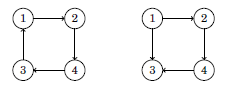
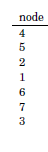
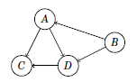

# Strong Connectivity

In a directed graph, the edges can be traversed in one direction only, so even if the graph is connected, this does not guarantee that there would be a path from a node to another node. For this reason, it is meaningful to define a new concept that requires more than connectivity.
**A graph is strongly connected if there is a path from any node to all other nodes in the graph.**

 For example, in the following picture, the left graph is strongly connected while the right graph is not.  

The strongly connected components of a graph divide the graph into strongly connected parts that are as large as possible. 
For example, for the graph


the strongly connected components are as follows:


<h2 align="center">Kosaraju’s Algorithm</h2>

Kosaraju’s algorithm is an efficient method for finding the strongly connected components of a directed graph. The algorithm performs two depth-first searches: 

- The first search constructs a list of nodes according to the structure of the graph, and 
- The second search forms the strongly connected components. We can find all strongly connected components in O(V+E) time using Kosaraju’s algorithm.

**Search 1**

The first phase of Kosaraju’s algorithm constructs a list of nodes in the order in which a depth-first search processes them. The algorithm goes through the nodes, and begins a depth-first search at each unprocessed node. Each node will be added to the list after it has been processed. (The output of this search will be similar to topological sorting output of it.)


We get the node in order :- 

**Search 2**

The second phase of the algorithm forms the strongly connected components of the graph. First, the algorithm reverses every edge in the graph. This guarantees that during the second search, we will always find strongly connected components that do not have extra nodes.

After reversing the edges, the example graph is as follows:


After this, the algorithm goes through the list of nodes created by the first search, in reverse order. If a node does not belong to a component, the algorithm creates a new component and starts a depth-first search that adds all new nodes found during the search to the new component.

So here we get Four component :


The output of strongly connected components form an acyclic component graph that represents the deep structure of the original graph.



### Implementation 

```cpp
#include<bits/stdc++.h>
using namespace std;

#define ll long long int

void dfsHelper(vector<ll>adj[],stack<ll>&st,vector<bool>&visited,ll src){
    visited[src]=1;
    for(auto u:adj[src]){
        if(!visited[u]){
            dfsHelper(adj,st,visited,u);
        }
    }
    st.push(src);
}

void kosaraju(vector<ll>adj[],ll n,vector<ll>adjR[]){
    stack<ll>st;
    stack<ll>temp;
    vector<bool>visited(n+1,0);
    for(ll i=1;i<=n;i++){
        if(!visited[i]){
            dfsHelper(adj,st,visited,i);
        }
    }
    ll component=0;
    ll ans=0;
    vector<bool>ivisited(n+1,0);
    while(!st.empty()){
        ll x = st.top();
        st.pop();
        if(ivisited[x])continue;
        component++;
        dfsHelper(adjR,temp,ivisited,x);
    }
    cout<<component<<endl;
}


int main(){
    ll n,m;
    cin>>n>>m;
    vector<ll>adj[n+1];
    vector<ll>adjR[n+1];
    for(ll i=0;i<m;i++){
        ll u,v;
        cin>>u>>v;
        adj[u].push_back(v);
        adjR[v].push_back(u);
    }
    kosaraju(adj,n,adjR);
}
```
