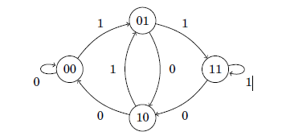

<h1 align="center">Paths & Circuits</h1>

 **A path leads from node a to node b through edges of the graph. A path is circuit if it starts and end at same node.**

This chapter focuses on two types of paths in graphs:

**Eulerian Path**
An *Eulerian Path* is a path that goes through each edge exactly once.

**Hamiltonian Path**
A *Hamiltonian Path* is a path that visits each node exactly once.

## Eulerian 

#### Paths

An **Eulerian Path** is a path that goes exactly once through each edge of the graph. 

For example, the graph 


has an Eulerian path from node 2 to node 5:


#### Circuit

An Eulerian circuit is an Eulerian path that starts and ends at the same node.
For example, the graph


has an Eulerian circuit that starts and ends at node 1:


### Existence for Eulerian

#### Un-Directed Graph

The existence of Eulerian paths and circuits depends on the degrees of the nodes. First, an undirected graph has an Eulerian path **when all the edges belong to the same connected component** and
	•  the degree of each node is even or
	•  the degree of exactly two nodes is odd, and the degree of all other nodes are even.
In the first case, each Eulerian path is also an Eulerian circuit. In the second case, the odd-degree nodes are the starting and ending nodes of an Eulerian path which is not an Eulerian circuit.

##### To convert Euler path to circuit connect the two odd degree nodes.

For example, in the **undirected** graph 

nodes 1, 3 and 4 have a degree of 2, and nodes 2 and 5 have a degree of 3. Exactly two nodes have an odd degree, so there is an Eulerian path between nodes 2 and 5, but the graph does not contain an Eulerian circuit. When we add a edge between the odd degree nodes then it becomes euler circuit.

##### Implementation to check the undirected graph has eulerian path or circuit.

 1. We use array of vectors to store the graph.

    ```cpp
    vector<int>adj[n+1];
    ```

 2. Check if all non-zero degree vertices are connected. We can check it by applying DFS on the non-zero degree vertices and check whether all vertices are visited or not whose vector size is greater than zero. 

    ```cpp
    bool isConnected(vector<int> adj[],int V) 
    { 
        // Mark all the vertices as not visited 
        bool visited[V+1]; 
        int i; 
        for (i = 1; i <=V; i++) 
            visited[i] = false; 
      
        // Find a vertex with non-zero degree 
        for (i = 1; i <=V; i++) 
            if (adj[i].size() != 0) 
                break; 
      
        // If there are no edges in the graph, return true 
        if (i == V) 
            return true; 
      
        // Start DFS traversal from a vertex with non-zero degree 
        DFSUtil(i, visited); 
      
        // Check if all non-zero degree vertices are visited 
        for (i = 1; i <=V; i++) 
           if (visited[i] == false && adj[i].size() > 0) 
                return false; 
      
        return true; 
    } 
    ```

 3. After we find that all non-zero degree vertices are connected . We check the graph has odd degree vertices or not. If there exist odd degree vertices then it has only Euler path. 

    ```cpp
    int isEulerian(vector<int>adj[],int V){
    	// Check if all non-zero degree vertices are connected 
        if (isConnected() == false) 
            return 0; 
      
        // Count vertices with odd degree 
        int odd = 0; 
        for (int i = 1; i <= V; i++) 
            if (adj[i].size() & 1) 
                odd++; 
      
        // If count is more than 2, then graph is not Eulerian 
        if (odd > 2) 
            return 0; 
      
        // If odd count is 2, then semi-eulerian. 
        // If odd count is 0, then eulerian 
        // Note that odd count can never be 1 for undirected graph 
        return (odd)? 1 : 2; 
    }
    ```

#### Directed Graph

In a directed graph, we focus on indegrees and outdegrees of the nodes. A directed graph contains an Eulerian path exactly when all the edges belong to the same connected component and

- in each node, the indegree equals the outdegree, or
- the ending node indegree is one larger than the outdegree & the outdegree of starting node is one larger than the indegree, and in all other nodes, the indegree equals the outdegree. 

In the first case, each Eulerian path is also an Eulerian circuit, and in the second case, the graph contains an Eulerian path that begins at the node whose outdegree is larger and ends at the node whose indegree is larger.
      For example, in the graph


nodes 1, 3 and 4 have both indegree 1 and outdegree 1, node 2 has indegree 1 and outdegree 2, and node 5 has indegree 2 and outdegree 1. Hence, the graph contains an Eulerian path from node 2 to node 5:


##### Implementation to check the directed graph has eulerian path or circuit.

 1. We use array of vectors to store the graph.

    ```cpp
    vector<int>adj[n+1];
    ```

 2. Calculate the indegree and outdegree of each node.

    - For all node if indegree==outdegree,then euler circuit if condition 3 satisfies
    - For all node if indegree==outdegree except 2 nodes, where |indegree-outdegree|=1 then euler path if condition 4 satisfies.

 3. If we start dfs from any node and all vertices get visited. And if some unvisited if there total degree if zero.

 4. Start DFS from node whose outdegree-indegree=1 and all vertices get visited. And if some unvisited if there total degree if zero.

The implementation to check is it possible to create euler circuit or not 

```cpp
void dfs(vector<int>adj[],vector<bool> &visited,int u){
        visited[u]=1;
        for(auto v: adj[u])
            if(!visited[v])
                dfs(adj,visited,v);
    }
    
bool isEuler(int V, vector<int>adj[]){
	  vector<int> indegree(V+1,0),outdegree(V+1,0);;
	  
      //Calculating indegree and outdegree
	  for(int i=1; i<=V; i++){
	    outdegree[i]=adj[i].size();
	      for(auto v: adj[i])
	          indegree[v]++;
	  }
      
	  int end=-1,start=-1;
	  for(int i=1; i<=V; i++){
	     if(indegree[i]!=outdegree[i]){
	        if(indegree[i]-outdegree[i]==1 && end!=-1){
	            end=i;
	         }else if(outdegree[i]-indegree[i]==1 && start!=-1){
	            start=i;
	         }else{
	            return false;
	         }
	      }
	    }
	   
      vector<bool> visited(V+1,0);
	  dfs(adj,visited,start);
	  for(int i=0;i<V;i++){
	     if(!visited[i] && (indegree[i]+outdegree[i]))   
	            return false;
	    }
	    return true;
	}
```

<div style="page-break-after: always; break-after: page;"></div>

### Hierholzer’s Algorithm for Directed graph

This algorithm is used to print an Euler Circuit for directed Eulerian Graph. We can find the circuit/path in O(E), i.e., linear time.

Remember that a directed graph has a Eulerian cycle if the following conditions are true 

(1) All vertices with nonzero degrees belong to a single strongly connected component. 

(2) In degree and out-degree of every vertex is the same. The algorithm assumes that the given graph has a Eulerian Circuit.

##### **Algorithm**

- Check if the given graph is eulerian.

- Choose any starting vertex u, and follow a trail of edges from that vertex until returning to u. It is not possible to get stuck at any vertex other than u, because indegree and outdegree of every vertex must be same, when the trail enters another vertex v there must be an unused edge leaving v.
  The tour formed in this way is a closed tour, but may not cover all the vertices and edges of the initial graph.
- As long as there exists a vertex w that belongs to the current tour, but that has adjacent edges not part of the tour, start another trail from w, following unused edges until returning to w, and join the tour formed in this way to the previous tour.

Thus the idea is to keep following unused edges and removing them until we get stuck. Once we get stuck, we backtrack to the nearest vertex in our current path that has unused edges, and we repeat the process until all the edges have been used.

##### Implementation

The complete implementation is :

```cpp
#include<bits/stdc++.h>
using namespace std;

bool isEuler(int V, vector<int>adj[]){
    //implementation given above;
}

int main(){
    int n,m;
    cin>>n>>m;
    vector<vector<int>>adj(n+1);
    vector<int>indegree(n+1,0);
    vector<int>outdegree(n+1,0);
    for(int i=0;i<m;i++){
        int u,v;
        cin>>u>>v;
        adj[u].push_back(v);
        indegree[v]++;
        outdegree[u]++;
    }
    //Eulerian for directed graph
    bool ans = isEuler(n,adj);
    //If Circuit then start can be any node
    //If Path then start must be node with outdegree-indegree=1
    if(ans){
        stack<int>curr_path;
        vector<int>ans;
        int curr_v = 1; 
        //This is used to Run the Loop isn't inserted in answer
        curr_path.push(1);
        while(!curr_path.empty()){
            if(outdegree[curr_v]){
                curr_path.push(curr_v); 
                int next_v = adj[curr_v].back();
                adj[curr_v].pop_back();
                outdegree[curr_v]--;
                curr_v=next_v;
            }else{
                ans.push_back(curr_v);
                /*For last node which is pushed the stack goes
                empty and hence not inserted since we dont 
                need it*/
                curr_v = curr_path.top();
                curr_path.pop();
            }
        }
        for (int i=ans.size()-1; i>=0; i--){ 
            cout << ans[i]<<" "; 
        }
    }else{
        cout<<"IMPOSSIBLE"<<endl;
    }
}
```

<div style="page-break-after: always; break-after: page;"></div>

### Hierholzer’s Algorithm for Un-Directed graph

This algorithm is similar to Hierholzer’s Algorithm used to print an Euler Circuit for directed Eulerian Graph. A little modification is done here we don’t use the backedge to travel the edge again. We can find the circuit/path in O(E), i.e., linear time.

Remember that a undirected graph has a Eulerian cycle if the following conditions are true 

(1) All vertices with nonzero degrees belong to a single strongly connected component. 

(2) All vertices has even degree.

#### **Algorithm**

In this question we need to find an euler circuit in a undirected graph.
Step 1:-  Check if the given graph is eulerian.

Step 2 :- If yes then, we use the Heirholzer with little modification that we don’t use the backedge to travel the edge again. So for this we use a map.

#### **Implementation**

```c++
#include<bits/stdc++.h>
using namespace std;

bool isEulerian(vector<int>adj[],int V){
    //implementation given above;
}

int main(){    
vector<ll>adj[n+1];
vector<ll>degree(n+1,0);
map<pair<ll, ll>,ll>edge;
  for(ll i=0;i<m;i++){
      ll u,v;
      cin>>u>>v;
      adj[u].push_back(v);
      adj[v].push_back(u);
      edge[{v,u}]=1;
      degree[u]++;
      degree[v]++;
   }
    //Eulerian for undirected graph
    bool ans= isEulerian(adj,n);
    if(ans==false){
        cout<<"IMPOSSIBLE";
    }else{
        //If Circuit then start can be any node
    	//If Path then start must be node with outdegree-indegree=1
        stack<int> curr_path;
        vector<int> circuit;
        curr_path.push(1);
        ll v = 1;
        while (!curr_path.empty())
        {
             if(degree[v]){
                ll next_v = adj[v].back();
                adj[v].pop_back();
                if(edge[{next_v,v}]==0)continue;
                curr_path.push(v);
                degree[v]--;
                degree[next_v]--;
                edge[{next_v,v}]=0;
                v=next_v;
            }else{
                circuit.push_back(v);
                v = curr_path.top();
                curr_path.pop();
            }

        }    
        for (int i=circuit.size()-1; i>=0; i--){
            cout << circuit[i]<<" ";
        }
    }
}    
```

<div style="page-break-after: always; break-after: page;"></div>

### De Bruijn Sequence

A De Bruijn sequence of order n on a size-k alphabet A is a sequence in which every possible  string of length n occurs exactly once as a substring.

**Approach:**

We can solve this problem by constructing a directed graph with K^(n-1) nodes and each node having k outgoing edges. Each node correspond to a string of size n-1. Every edge corresponds to one of the k characters in A .

For example, if n=3 and k=2, then we construct the following graph :



We can observe that every node in this graph has equal in-degree and out-degree, which means that a Eulerian circuit exists in this graph. The Eulerian circuit will correspond to a de Bruijn sequence as every combination of a node and an outgoing edge represents a unique string of length n.


So we simply use dfs to construct the string and insert them in a vector to keep a track that we dont create it again. And once we reach a node where it don’t have any edges to travel. We push the edge in the sequence string. Similar to euler circuit, we push the edge when we dont have any edges to go. And search for edges from the last visited node.

```
#include <bits/stdc++.h> 
using namespace std; 
  
unordered_set<string> seen; 
vector<int> edges; 
  
// Modified DFS in which no edge 
// is traversed twice 
void dfs(string node, int& k, string& A) 
{ 
    for (int i = 0; i < k; ++i) { 
        string str = node + A[i]; 
        if (seen.find(str) == seen.end()) { 
            seen.insert(str); 
            dfs(str.substr(1), k, A); 
            //Similar to euler circuit, we push the edge when we dont have any edges to go.
            edges.push_back(i); 
        } 
    } 
} 
  
// Function to find a de Bruijn sequence 
// of order n on k characters 
string deBruijn(int n, int k, string A) 
{ 
  
    // Clearing global variables 
    seen.clear(); 
    edges.clear(); 
  
    string startingNode = string(n - 1, A[0]); 
    dfs(startingNode, k, A); 
  
    string S; 
  
    // Number of edges 
    int l = pow(k, n); 
    for (int i = 0; i < l; ++i) 
        S += A[edges[i]]; 
    S += startingNode; 
  
    return S; 
} 
  
int main() 
{ 
    int n = 3, k = 2; 
    string A = "01"; 
  
    cout << deBruijn(n, k, A); 
  
    return 0; 
} 
```

<div style="page-break-after: always; break-after: page;"></div>

## Hamiltonian

### Path

A Hamiltonian path is a path that visits each node of the graph exactly once.
For example, the graph


contains a Hamiltonian path from node 1 to node 3:


### Circuit

If a Hamiltonian path begins and ends at the same node, it is called a Hamiltonian circuit. The graph above also has an Hamiltonian circuit that begins and ends at node 1:


### Existence

No efficient method is known for testing if a graph contains a Hamiltonian path, and the problem is NP-hard. Still, in some special cases, we can be certain that a graph contains a Hamiltonian path.
A simple observation is that if the graph is complete, i.e., there is an edge between all pairs of nodes, it also contains a Hamiltonian path. Also stronger results have been achieved:

• **Dirac’s theorem:** If the degree of each node is at least n/2, the graph contains a Hamiltonian path.
• **Ore’s theorem:** If the sum of degrees of each non-adjacent pair of nodes is at least n, the graph contains a Hamiltonian path.

A common property in these theorems and other results is that they guarantee the existence of a Hamiltonian path if the graph has a large number of edges. This makes sense, because the more edges the graph contains, the more possibilities there is to construct a Hamiltonian path. But there can be some graph which doesn’t satisfy this property but still they are Hamiltonian Path.

**Approach**

We use backtracking to solve this problem. We pick up the first vertex and check all the vertex it can travel and go to adjacent vertex only if it isn’t included in my current path yet.

At any point of time when path (array size == total no of nodes) we return true that it is Hamiltonian path and if there is a edge from last node to first node then it is Hamiltonian cycle.

Since there is no efficient way to check if a Hamiltonian path exists, it is clear that there is also no method to efficiently construct the path, because otherwise we could just try to construct the path and see whether it exists.
A simple way to search for a Hamiltonian path is to use a backtracking algorithm that goes through all possible ways to construct the path. The time complexity of such an algorithm is at least O(n!), because there are n! different ways to choose the order of n nodes.

#### Implementation

The complete implementation is :

```cpp
#include <bits/stdc++.h> 
using namespace std; 
  
// Number of vertices in the graph  
#define V 5  
  
void printSolution(int path[]);  
  
/* A utility function to check if  
the vertex v can be added at index 'pos'  
in the Hamiltonian Cycle constructed  
so far (stored in 'path[]') */
bool isSafe(int v, bool graph[V][V],  
            int path[], int pos)  
{  
    /* Check if this vertex is an adjacent  
    vertex of the previously added vertex. */
    if (graph [path[pos - 1]][ v ] == 0)  
        return false;  
  
    /* Check if the vertex has already been included.  
    This step can be optimized by creating 
    an array of size V */
    for (int i = 0; i < pos; i++)  
        if (path[i] == v)  
            return false;  
  
    return true;  
}  
  
/* A recursive utility function  
to solve hamiltonian cycle problem */
//Here pos is the index of path array
bool hamCycleUtil(bool graph[V][V],  
                  int path[], int pos)  
{  
    /* base case: If all vertices are  
    included in Hamiltonian Cycle */
    
    if (pos == V)  
    { 
        /*For Hamiltonian path just return true since 
        all vertex are covered*/
        // And if there is an edge from the  
        // last included vertex to the first vertex  
        if (graph[path[pos - 1]][path[0]] == 1)  
            return true;  
        else
            return false;  
    }  
  
    // Try different vertices as a next candidate  
    // in Hamiltonian Cycle. We don't try for 0 as  
    // we included 0 as starting point in hamCycle()  
    for (int v = 1; v < V; v++)  
    {  
        /* Check if this vertex can be added  
        // to Hamiltonian Cycle */
        if (isSafe(v, graph, path, pos))  
        {  
            path[pos] = v;  
  
            /* recur to construct rest of the path */
            if (hamCycleUtil (graph, path, pos + 1) == true)  
                return true;  
  
            /* If adding vertex v doesn't lead to a solution,  
            then remove it */
            path[pos] = -1;  
        }  
    }  
  
    /* If no vertex can be added to  
    Hamiltonian Cycle constructed so far,  
    then return false */
    return false;  
}  
  
/*Initilazing the first vertex and using hamCycleUtil*/
bool hamCycle(bool graph[V][V])  
{  
    int *path = new int[V];  
    for (int i = 0; i < V; i++)  
        path[i] = -1;  
  
    /* Let us put vertex 0 as the first vertex in the path. 
    If there is a Hamiltonian Cycle, then the path can be  
    started from any point of the cycle as the graph is undirected */
    path[0] = 0;  
    if (hamCycleUtil(graph, path, 1) == false )  
    {  
        cout << "\nSolution does not exist";  
        return false;  
    }  
  
    printSolution(path);  
    return true;  
}  
  
/* A utility function to print solution */
void printSolution(int path[])  
{  
    cout << "Solution Exists:"
            " Following is one Hamiltonian Cycle \n";  
    for (int i = 0; i < V; i++)  
        cout << path[i] << " ";  
  
    // Let us print the first vertex again 
    // to show the complete cycle  
    cout << path[0] << " ";  
    cout << endl; 
}  
  
// Driver Code  
int main()  
{  
    /* Let us create the following graph  
        (0)--(1)--(2)  
        | / \ |  
        | / \ |  
        | / \ |  
        (3)-------(4) */
    bool graph1[V][V] = {{0, 1, 0, 1, 0},  
                        {1, 0, 1, 1, 1},  
                        {0, 1, 0, 0, 1},  
                        {1, 1, 0, 0, 1},  
                        {0, 1, 1, 1, 0}};  
      
    // Print the solution  
    hamCycle(graph1);  
      
    /* Let us create the following graph  
    (0)--(1)--(2)  
    | / \ |  
    | / \ |  
    | / \ |  
    (3) (4) */
    bool graph2[V][V] = {{0, 1, 0, 1, 0},  
                         {1, 0, 1, 1, 1},  
                         {0, 1, 0, 0, 1},  
                         {1, 1, 0, 0, 0},  
                         {0, 1, 1, 0, 0}};  
  
    // Print the solution  
    hamCycle(graph2);  
    return 0;  
} 
```

<div style="page-break-after: always; break-after: page;"></div>

#### Warnsdorf’s rule

Warnsdorf’s rule is a simple and effective heuristic for finding a knight’s tour.
Using the rule, it is possible to efficiently construct a tour even on a large board. The idea is to always move the knight so that it ends up in a square where the number of possible moves is as small as possible. For example, in the following situation, there are five possible squares to which the knight can move (squares a... e):


In this situation, Warnsdorf’s rule moves the knight to square a, because after this choice, there is only a single possible move. The other choices would move the knight to squares where there would be three moves available.

The complete implementation is :

```cpp
#include <bits/stdc++.h> 
#define N 8 
using namespace std;  
// Move pattern on basis of the change of 
// x coordinates and y coordinates respectively 
static int cx[N] = {1,1,2,2,-1,-1,-2,-2}; 
static int cy[N] = {2,-2,1,-1,2,-2,1,-1}; 
  
// function restricts the knight to remain within 
// the 8x8 chessboard 
bool limits(int x, int y) 
{ 
    return ((x >= 0 && y >= 0) && (x < N && y < N)); 
} 
  
/* Checks whether a square is valid and empty or not */
bool isempty(int a[], int x, int y) 
{ 
    return (limits(x, y)) && (a[y*N+x] < 0); 
} 
  
/* Returns the number of empty squares adjacent 
   to (x, y) */
int getDegree(int a[], int x, int y) 
{ 
    int count = 0; 
    for (int i = 0; i < N; ++i) 
        if (isempty(a, (x + cx[i]), (y + cy[i]))) 
            count++; 
  
    return count; 
} 
  
// Picks next point using Warnsdorff's heuristic. 
// Returns false if it is not possible to pick 
// next point. 
bool nextMove(int a[], int *x, int *y) 
{ 
    int min_deg_idx = -1, c, min_deg = (N+1), nx, ny; 
  
    // Try all N adjacent of (*x, *y) starting 
    // from a random adjacent. Find the adjacent 
    // with minimum degree. 
    int start = rand()%N; 
    for (int count = 0; count < N; ++count) 
    { 
        int i = (start + count)%N; 
        nx = *x + cx[i]; 
        ny = *y + cy[i]; 
        if ((isempty(a, nx, ny)) && 
           (c = getDegree(a, nx, ny)) < min_deg) 
        { 
            min_deg_idx = i; 
            min_deg = c; 
        } 
    } 
  
    // IF we could not find a next cell 
    if (min_deg_idx == -1) 
        return false; 
  
    // Store coordinates of next point 
    nx = *x + cx[min_deg_idx]; 
    ny = *y + cy[min_deg_idx]; 
  
    // Mark next move 
    a[ny*N + nx] = a[(*y)*N + (*x)]+1; 
  
    // Update next point 
    *x = nx; 
    *y = ny; 
  
    return true; 
} 
  
/* displays the chessboard with all the 
  legal knight's moves */
void print(int a[]) 
{ 
    for (int i = 0; i < N; ++i) 
    { 
        for (int j = 0; j < N; ++j) 
            printf("%d\t",a[j*N+i]); 
        printf("\n"); 
    } 
} 
  
/* checks its neighbouring sqaures */
/* If the knight ends on a square that is one 
   knight's move from the beginning square, 
   then tour is closed */
bool neighbour(int x, int y, int xx, int yy) 
{ 
    for (int i = 0; i < N; ++i) 
        if (((x+cx[i]) == xx)&&((y + cy[i]) == yy)) 
            return true; 
  
    return false; 
} 
  
/* Generates the legal moves using warnsdorff's 
  heuristics. Returns false if not possible */
bool findClosedTour(int sx,int sy) 
{ 
    // Filling up the chessboard matrix with -1's 
    int a[N*N]; 
    for (int i = 0; i< N*N; ++i) 
        a[i] = -1; 
  
    // Current points are same as initial points 
    int x = sx, y = sy; 
    a[y*N+x] = 1; // Mark first move. 
  
    // Keep picking next points using 
    // Warnsdorff's heuristic 
    for (int i = 0; i < N*N-1; ++i) 
        if (nextMove(a, &x, &y) == 0) 
            return false; 
  
    // Check if tour is closed (Can end 
    // at starting point) 
    if (!neighbour(x, y, sx, sy)) 
        return false; 
  
    print(a); 
    return true; 
} 
  
int main() 
{ 
    // To make sure that different random 
    // initial positions are picked. 
    srand(time(NULL)); 
    int sx ; 
    int sy ;
    cin>>sx>>sy;
    // While we don't get a solution which satisfies hamiltonian cycle property
    while (!findClosedTour(sx-1,sy-1)) 
    { 
    ; 
    } 
  //We can ignore this while if we need simply any path
    return 0; 
}
```

